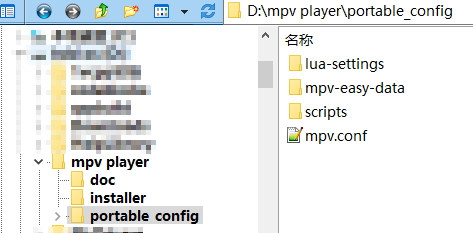
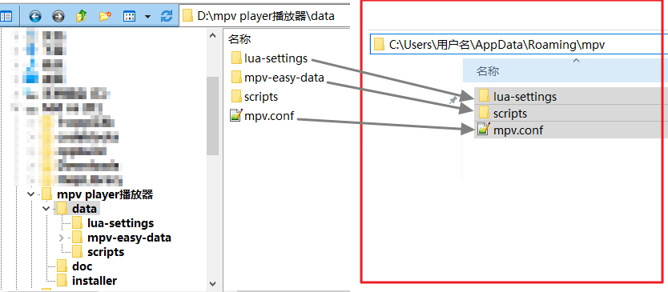

# MPV-EASY Player

### MPV-EASY Player 一个易于使用,基于MPV的播放器

基本上MPV-EASY Player就是在对MPV的manual.pdf（说明文档）充分阅读和理解的情况下，对MPV、mpv配置、lua脚本(包含github他人分享的)、js脚本进行的拼装和组合。

当然，作为小半个前端，还做了很多、一些或者少量其他的事情，甚至很多都是投机取巧的实现，毕竟只靠mpv和脚本，有些功能并不能很好的整合在一起（内心：主要还是“代码能力严重欠缺”）。

所以这并不是一个能够跨平台使用的播放器，只能在windows下蹦跶，甚至好像很多行为都是违反各种协议的。

不过既然除了2个exe文件，MPV-EASY Player具有的其他文件已经放到了github这里，那么这些文件对于你使用原版mpv肯定是非常有用的，少许修改放入mpv中就能让mpv获得一些或者很多的提升，不管你是在windows、mac、linux下使用mpv，这些都是支持或者大部分都支持的。

不要问我为什么在在windows、mac、linux都行：那是因为这三个操作系统我都有，什么前端的mpv我都用过，毕竟每个操作系统图形化界面下操作老熟悉了（精通点鼠标）。

如果你没有接触过其中一些操作系统，那么放过自己吧，好奇心会浪费你很多时间和精力，甚至会很累（建议第三个，什么分支、依赖、各种包管理、编译、输入法、显卡驱动、前端、各种不同图形环境带来的兼容性问题最给劲了）

或许你会问为什么不使用各种基于mpv的图形化前端，那是因为当你从说明文档中充分了解完这个播放器之后，你会发现只有原生的mpv才能让这个播放器变的最为强大、有趣和无限可能，因为你需要添加各种参数还有脚本。

大部分前端或多或少在参数还有脚本这些方面会有欠缺，最常见的就是看不见osc了（毕竟用不着了），你不知道lua脚本是否支持，参数在哪个文件中添加，应该放在哪，最后发现还是原版的比较省力些。

又是当然：世事无绝对，以上这些随着时间、事情的发展、人思想的转变、技术的进步都有可能落伍、错误，所以以上这些你甚至可以忽略不用看。

### 那我为什么要写以上这些？还放在最前面？

为了尽量浪费你宝贵的时间啊。

### 如何获得MPV的manual.pdf（说明文档）

https://mpv.io/manual/ 在这个网页中你可以看到html版的说明文档，也可以下载到pdf版，或者在你下载的mpv压缩包中也是包含这个manual.pdf的。

查看说明文档当然是重中之重，你可以知道哪些文件要放在什么路径下才会生效，什么参数才能激活什么功能，**十万个mpv的为什么**尽在其中。不过文档是英文的，看的时候用个翻译软件吧。

### 【portable-data】【mpv-easy-data】2个文件夹的益处

既然我已经上传了这2个文件夹中的所有文件，那就说明你看manual.pdf的负担能够减轻很多（写MPV-EASY Player也是为了减轻大家的负担，毕竟很多痛苦的过程，浪费的时间一个人承受就足够了），甚至只需要打开这2个文件夹中的一些文件，对里面的文本进行复制粘贴即可获得你想要的结果，**所以下面这些文字的目的都是为了把MPV-EASY Player中的大部分功能迁移到mpv下作的说明**，你也可以了解2者在运行和功能方面的差异，

这样一来，不管你在什么平台下使用mpv，即使MPV-EASY Player出现bug、版本不更新、不兼容最新版mpv，都可以靠自己获得一个更加强大，更加顺手，甚至属于你自己的mpv player，当然也可以让你更快发现MPV-EASY Player中的bug，以及加入新的功能。

### MPV-EASY Player和mpv文件夹结构的异同

既然MPV-EASY Player源自于mpv，那么2者的文件夹结构其实是非常类似的，所以把前者的设置、文件迁移到后者也非常简单。

那为什么MPV-EASY Player不使用和mpv相同的文件夹结构呢？

那是因为mpv的lua脚本不支持存放在中文路径下使用，所以进行了部分的分离，MPV-EASY Player通过运行前的处理让mpv支持存放在中文路径下时能调用lua脚本，所以你在使用mpv时也一定要注意lua脚本和中文路径的问题，最好在全英文路径下使用。

或许下面所说的文件存放路径、结构、调用方式和你之前所认为的、理所当然的方式有很多出入，甚至可能是多此一举的，但这些功夫都是为中文路径的支持，以及把尽可能少的文件存放到c盘纯英文路径下做的努力，好让大部分数据都保存在非C盘，防止配置文件的丢失和软件的丢失。

## 如何把MPV-EASY Player的2个文件夹改变到适用于mpv(windows)

windows下mpv支持读取的配置路径基本包含2种。你只需要选择使用其中一种即可。

#### 第一种(仅支持在纯英文路径下完全正常工作):

步骤：

1.下载程序。

从网上https://mpv.srsfckn.biz/ 或者 https://sourceforge.net/projects/mpv-player-windows/files/ 下载mpv程序的压缩包，解压到本地，比如图上是解压到mpv player文件夹下，所以你可以在mpv player文件夹中看到mpv.exe这个文件。

2.创建不能变动的文件夹和文件。

打开mpv.exe所在的文件夹(例子中也就是开打mpv player文件夹)，以mpv.exe所在的路径创建以下子文件夹和文件，这些文件和文件夹的名字和路径都是不能变动的。

>mpv.exe所在文件夹\portable_config

>mpv.exe所在文件夹\portable_config\lua-settings

>mpv.exe所在文件夹\portable_config\scripts

>mpv.exe所在文件夹\portable_config\mpv.conf

不理解的话请参考上方图片，文件夹和文件的作用请参考manual.pdf文档

mpv默认就会读取portable_config这个子文件夹下的各种配置，所以接下来所有的文件都会存放于portable_config文件夹中在改动。

3、文件导入到portable_config文件夹下。

从[这个网页](https://github.com/422658476/MPV-EASY-Player)顶部打包下载【portable-data】【mpv-easy-data】文件夹。

把【portable-data】**文件夹内**的所有东西放入【mpv.exe所在文件夹\portable_config】

把【mpv-easy-data】**“连同文件夹本身”**直接放入【mpv.exe所在文件夹\portable_config】

导入文件后就会和图上的结构一样了，你也可以在这时手动确认一下文件夹和文件结构是否和图上一样。

4、修改mpv.conf文件内容，让mpv能够正常读取。

修改mpv.conf的目的：
a.引导mpv去读取下面路径中的配置文件

>mpv.exe所在文件夹\portable_config\mpv-easy-data\input.conf

>mpv.exe所在文件夹\portable_config\mpv-easy-data\rjno1.conf

b.让mpv把历史记录文件保存到以下路径中

>mpv.exe所在文件夹\portable_config\mpv-easy-data\watch_later

打开【mpv.exe所在文件夹\portable_config】下的mpv.conf，检查每一行开头是否都有#号，没有的话请添加#号（以#号开头的每行文本都会被mpv认为是注释，不会产生任何作用）。

检查完毕之后往mpv.conf中添加下面这5行：

>input-conf=portable_config\mpv-easy-data\input.conf

>include=portable_config\mpv-easy-data\rjno1.conf

>watch-later-directory=portable_config\mpv-easy-data\watch_later

>profile="ini-rjno1"

>write-filename-in-watch-later-config

由于使用的是相对路径，所以不管今后mpv player文件夹被移动到任何**纯英文路径**下，无需任何处理配置都能正常工作。

#### 第二种(支持中文路径，但某些文件要复制到c盘):

第二种则是从第一种演变而来，当你拥有第一种之后，在它基础上稍加操作就能变成第二种。

第二种方法主要是利用mpv在c盘的配置文件夹本身就是纯英文路径来解决lua脚本不支持中文路径的问题。

1.重命名第一种中的【portable_config】文件夹，比如重命名成【data】文件夹，你将会得到以下这些，就像图中那样

>mpv.exe所在文件夹\data

>mpv.exe所在文件夹\data\lua-settings

>mpv.exe所在文件夹\data\scripts

>mpv.exe所在文件夹\data\mpv.conf

>mpv.exe所在文件夹\data\mpv-easy-data

【data】文件夹可以移动和更改到任何路径下，如果想要和mpv一起方便迁移，或者不熟悉mpv，那么还是建议放在mpv.exe所在文件夹下

【mpv-easy-data】文件夹可以配合下面第二步对mpv.conf的修改，移动和更改到任何路径下，如果想要和mpv一起方便迁移，或者不熟悉mpv，那么还是建议放在【mpv.exe\data】文件夹下

2.打开【mpv.exe所在文件夹\data】下的mpv.conf，检查每一行开头是否都有#号，没有的话请添加#号（以#号开头的每行文本都会被mpv认为是注释，不会产生任何作用）。

修改mpv.conf的目的：引导mpv去读取下面路径中的配置文件

检查完毕之后mpv.conf中之前这5行修改成：

>input-conf=data\input.conf

>include=data\mpv-easy-data\rjno1.conf

>watch-later-directory=data\mpv-easy-data\watch_later

>profile="ini-rjno1"

>write-filename-in-watch-later-config

由于使用的是相对路径，今后【mpv player播放器】文件夹（参考下面第三步）变更路径后都无需对mpv.conf进行任何修改。

3.把mpv.exe所在的文件夹和【data】文件夹转移到你想要存放的路径下（支持中文路径），比如我们迁移到

>D:\mpv player播放器\mpv.exe

>D:\mpv player播放器\data

4、复制或剪切（建议复制）【data】文件夹下的【lua-settings】、【scripts】文件夹和【mpv.conf】文件到下面这个路径下，【mpv】文件夹不存在请自行创建

>C:\Users\用户名\AppData\Roaming\mpv

5、每次修改完【data】文件夹中的数据后，重新执行第四步的操作后在运行mpv.exe，修改的内容才会生效；重装系统导致【C:\Users\用户名\AppData\Roaming\mpv】下的数据丢失，也只需要重新执行第四步即可正常.

# MPV播放器的使用（包括参数更改、lua脚本、js脚本、自定义快捷键）

当你通过以上步骤知道如何在windows下灵活的正常使用mpv后，就可以开始对mpv进行各种自定义了，当然自定义基于你对manual.pdf（说明文档）中内容的了解程度而定，越熟悉越能使其强大，如果你并不关心manual.pdf（说明文档），那么也无所谓，因为【portable-data】【mpv-easy-data】文件夹中的已经添加的设置足够强大

注意：如果默认参数不能够让mpv正常工作的话，那就说明mpv在版本升级的时候进行了某些参数的更改，你需要对比新旧版本manual.pdf文档，或者查看更新日志找出差别。

---
### 如果你的mpv需要一些最基本的默认参数，那么可以直接复制[rjno1.conf](https://github.com/422658476/MPV-EASY-Player/blob/master/mpv-easy-data/rjno1.conf)中的参数，然后在进行修改
---

### 对mpv进行各种自定义主要修改哪些文件和文件夹

>mpv-easy-data\input.conf  主要用来自定义快捷键，文件中已经包含了充分的示例，也已经有了少量修改的快捷键

>mpv-easy-data\rjno1.conf  主要调整mpv的设置参数，这些设置本来是放在mpv.conf中的，现在已经转为存放在rjno1.conf中，因此mpv.conf无需变动也不建议变动，看到mpv.conf中profile="ini-rjno1"与rjno1.conf中的[ini-rjno1]了吗，其中的**ini-rjno1**可以更改，但要保持一致

>scripts文件夹  从网上得到的mpv的lua脚本、js脚本、自己制作的lua、js脚本要放在这个文件夹中才会被mpv有效读取

>lua-settings文件夹  在这个文件夹中创建和脚本名字对应的.conf文件，可以更改脚本中提供的设置，具体用法要看脚本作者对脚本的解释说明

 
### [【portable-data/scripts】](https://github.com/422658476/MPV-EASY-Player/tree/master/portable-data/scripts) 文件夹中提供的lua脚本和js脚本已经进行了哪些方面的增强

【portable-data】中的脚本文件大部分都可以从github中找到，有些已经进行了些许修改，有些需要你查看脚本中的快捷键、注释、脚本下载页面的说明才能调用，小部分则是MPV-EASY-Player中原创的脚本，你也可以根据脚本中的注释进行改进和bug修正

>osd-bar.lua    MPV-EASY-Player原创,配合rjno1.conf中osd开头的参数，可以美观的让进度条一直显示

>playlistnoplayback.lua    MPV-EASY-Player原创，如果你启用了记录播放历史和进度功能，在播放播放列表时这个lua脚本可以解决播放下个文件时自动跳转到之前播放进度的问题，也就是让播放列表每次播放下个文件总是从头播放

>other.js    MPV-EASY-Player原创，用来自动保存音量，使得下次播放都使用上次调整过的音量，不过这个脚本要在mpv中正常使用需要你进行修改。

>osc.lua   MPV-EASY-Player修改自[官方原版](https://github.com/mpv-player/mpv/tree/master/player/lua) ，如果你了解lua脚本，可以让你在osc方面拥有完全的自定义，目前修改过的代码在较小尺寸还有显示bug

>autoload.lua   自动加载为播放列表

>ontop-playback.lua    播放时置顶显示

>open-file-dialog.lua   显示打开文件界面，需要你按下脚本中的快捷键才能使用

>pause-when-minimize.lua    最小化是自动暂停

>playlistmanager.lua   高级播放列表，代码经过些许修改，需要你按下脚本中的快捷键才能使用

### mpv可以使用的各种脚本请参考这个汇总页面

https://github.com/mpv-player/mpv/wiki/User-Scripts

### 如何把MPV-EASY Player的2个文件夹改变到适用于mpv(mac和linux)

如果你已经在windows下完全掌握了之前【如果如果如何把MPV-EASY Player的2个文件夹改变到适用于mpv(windows)】中描述的2种方法，那么这些设置迁移到mac和linux也非常简单，

【portable-data】【mpv-easy-data】文件夹按照结构放到以下路径后，依旧按照上方教程修改一下mpv.conf文件即可

linux（下方的~代表的是linux下的home分区，.config是一个隐藏文件夹，需要文件管理器开启【显示隐藏文件】才能看到）：

~/.config/mpv/lua-settings

~/.config/mpv/scripts

~/.config/mpv/mpv.conf

~/.config/mpv/mpv-easy-data

mac（下方的~代表的是mac下的【个人目录】也就是home文件夹，.config是一个隐藏文件夹，需要【个人目录】下Command+Shift+G后输入.config后进入）：

【个人目录】=finder->mac->mac系统分区->用户文件夹->用户名文件夹

mac没有home？no no no

使用mac系统的绝大部分人【个人目录】应该都放在了系统分区，如果你已经给mac分过区，并且使用过【设置】-【用户与群组】-【当前用户】右键菜单-【高级选项】-【个人目录】，那么可以把【个人目录】像linux一样挂载到非系统目录下，这样的好处显而易见，个人资料和设置与系统完全分离，重装系统最为干净。

~/.config/mpv/lua-settings

~/.config/mpv/scripts

~/.config/mpv/mpv.conf

~/.config/mpv/mpv-easy-data
