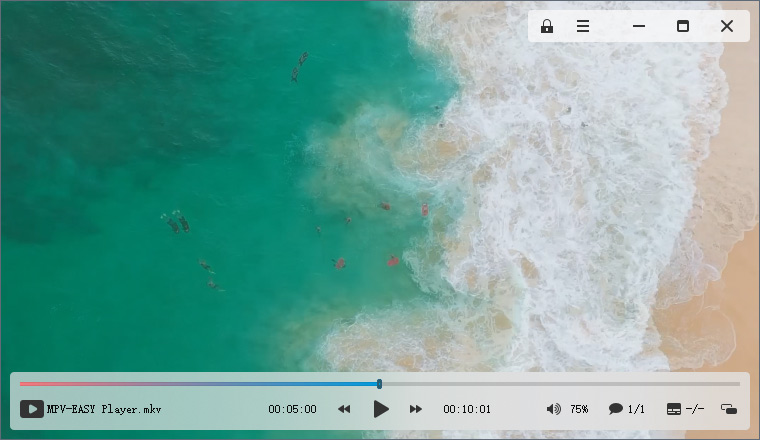

# MPV-EASY Player

###   🌐 Language of this page  : `中文` | [`English`](https://github-com.translate.goog/422658476/MPV-EASY-Player?_x_tr_sl=zh-CN&_x_tr_tl=en&_x_tr_hl=zh-CN&_x_tr_pto=wapp)

### [MPV-EASY Player](https://www.rjno1.com/mpv-easy-player/) : 一个基于[MPV](https://github.com/mpv-player/mpv/),易于使用,现代化的视频播放器

### [MPV-EASY Player](https://www.rjno1.com/mpv-easy-player/)  : An easy to use, modern video player based on [MPV](https://github.com/mpv-player/mpv/)

All the content on this page is described in Chinese. 

If you don't know the Chinese language, it doesn't matter. You can download it from the [release](https://github.com/422658476/MPV-EASY-Player/releases) page and try to use it. The interface of MPV-EASY Player supports display in Chinese, English and additional languages described below.

---

### MPV EASY Player的简介

https://github.com/422658476/MPV-EASY-Player/wiki

#### 【1】Help translate language files【帮助翻译语言文件】

https://github.com/422658476/MPV-EASY-Player/wiki/%E3%80%901%E3%80%91Help-translate-language-files%E3%80%90%E5%B8%AE%E5%8A%A9%E7%BF%BB%E8%AF%91%E8%AF%AD%E8%A8%80%E6%96%87%E4%BB%B6%E3%80%91

#### 【2】Configuration folder structure【配置文件夹的结构】

https://github.com/422658476/MPV-EASY-Player/wiki/%E3%80%902%E3%80%91Configuration-folder-structure%E3%80%90%E9%85%8D%E7%BD%AE%E6%96%87%E4%BB%B6%E5%A4%B9%E7%9A%84%E7%BB%93%E6%9E%84%E3%80%91

#### 【3】Get and use mpv's manual【获得和使用mpv的说明文档】

https://github.com/422658476/MPV-EASY-Player/wiki/%E3%80%903%E3%80%91Get-and-use-mpv's-manual%E3%80%90%E8%8E%B7%E5%BE%97%E5%92%8C%E4%BD%BF%E7%94%A8mpv%E7%9A%84%E8%AF%B4%E6%98%8E%E6%96%87%E6%A1%A3%E3%80%91

#### 【4】About (portable data) (mpv easy data) 2 folders 【关于(portable data) (mpv easy data)2个文件夹】

https://github.com/422658476/MPV-EASY-Player/wiki/%E3%80%904%E3%80%91About-(portable-data)-(mpv-easy-data)-2-folders-%E3%80%90%E5%85%B3%E4%BA%8E(portable-data)-(mpv-easy-data)2%E4%B8%AA%E6%96%87%E4%BB%B6%E5%A4%B9%E3%80%91

#### 【5】Use of the player (including parameter changes, lua scripts, js scripts) 【播放器的使用（包括参数更改、lua脚本、js脚本）】

https://github.com/422658476/MPV-EASY-Player/wiki/%E3%80%905%E3%80%91Use-of-the-player-(including-parameter-changes,-lua-scripts,-js-scripts)-%E3%80%90%E6%92%AD%E6%94%BE%E5%99%A8%E7%9A%84%E4%BD%BF%E7%94%A8%EF%BC%88%E5%8C%85%E6%8B%AC%E5%8F%82%E6%95%B0%E6%9B%B4%E6%94%B9%E3%80%81lua%E8%84%9A%E6%9C%AC%E3%80%81js%E8%84%9A%E6%9C%AC%EF%BC%89%E3%80%91

#### 【6】How to Customize OSC Styles【如何自定义OSC样式】

https://github.com/422658476/MPV-EASY-Player/wiki/%E3%80%906%E3%80%91How-to-Customize-OSC-Styles%E3%80%90%E5%A6%82%E4%BD%95%E8%87%AA%E5%AE%9A%E4%B9%89OSC%E6%A0%B7%E5%BC%8F%E3%80%91

#### 【7】Keyboard Control【快捷键】

https://github.com/422658476/MPV-EASY-Player/wiki/%E3%80%907%E3%80%91Keyboard-Control%E3%80%90%E5%BF%AB%E6%8D%B7%E9%94%AE%E3%80%91

#### 【8】MPV EASY Player for mac and linux【在mac和linux下使用MPV EASY Player】

https://github.com/422658476/MPV-EASY-Player/wiki/%E3%80%908%E3%80%91MPV-EASY-Player-for-mac-and-linux%E3%80%90%E5%9C%A8mac%E5%92%8Clinux%E4%B8%8B%E4%BD%BF%E7%94%A8MPV-EASY-Player%E3%80%91

---

