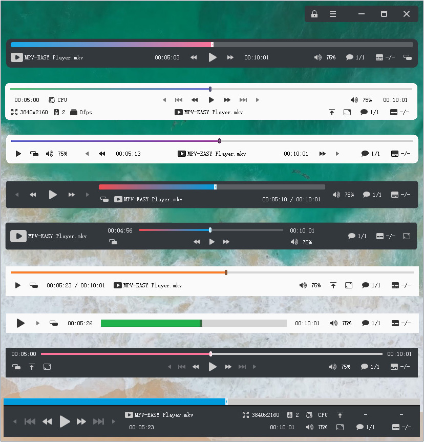

# MPV-EASY Player

###   🌐 Language of this page  : `中文` | [`English`](https://github-com.translate.goog/422658476/MPV-EASY-Player?_x_tr_sl=zh-CN&_x_tr_tl=en&_x_tr_hl=zh-CN&_x_tr_pto=wapp)

### [MPV-EASY Player](https://www.rjno1.com/mpv-easy-player/) : 一个基于[MPV](https://github.com/mpv-player/mpv/),易于使用,现代化的视频播放器

### [MPV-EASY Player](https://www.rjno1.com/mpv-easy-player/)  : An easy to use, modern video player based on [MPV](https://github.com/mpv-player/mpv/)

All the content on this page is described in Chinese. 

If you don't know the Chinese language, it doesn't matter. You can download it from the [release](https://github.com/422658476/MPV-EASY-Player/releases) page and try to use it. The interface of MPV-EASY Player supports display in Chinese, English and additional languages described below.


---

## 帮助翻译MPV-EASY Player的语言文件

如果你喜欢这个播放器，并且有能力把它翻译成你熟悉的语言：

[language](https://github.com/422658476/MPV-EASY-Player/tree/master/language) :路径下已经提供了中文和英文语言文件，你可以下载它们进行参考，并且利用这2个语言文件和qt语言家，可以翻译成其他语言。

中文语言文件包括：[cn-mpveasygui.ts](https://github.com/422658476/MPV-EASY-Player/blob/master/language/cn-mpveasygui.ts) 和 [cn-mpveasysettings.ts](https://github.com/422658476/MPV-EASY-Player/blob/master/language/cn-mpveasysettings.ts)

英文语言文件包括：[en-mpveasygui.ts](https://github.com/422658476/MPV-EASY-Player/blob/master/language/en-mpveasygui.ts) 和 [en-mpveasysettings.ts](https://github.com/422658476/MPV-EASY-Player/blob/master/language/en-mpveasysettings.ts)

翻译结束后只需要把新的语言文件发到[issues](https://github.com/422658476/MPV-EASY-Player/issues)即可。

当然你也可以修正英文语言文件中的翻译。

万分感谢。

#### 已支持的额外语言:

+ 意大利语语言文件(**it-mpveasygui.ts**和**it-mpveasysettings.ts**)：感谢[bovirus](https://github.com/bovirus)提供的意大利语翻译和对英语翻译的修正。

## Help translate language files of MPV-EASY Player

If you like this player and have the ability to translate it into a language you are familiar with:

[language](https://github.com/422658476/MPV-EASY-Player/tree/master/language) :Chinese and English language files have been provided under the path, you can download them for reference, and use these 2 language files and qt linguist to translate into other languages.

Chinese language files include: [cn-mpveasygui.ts](https://github.com/422658476/MPV-EASY-Player/blob/master/language/cn-mpveasygui.ts) and [cn-mpveasysettings.ts](https://github.com/422658476/MPV-EASY-Player/blob/master/language/cn-mpveasysettings.ts)

English language files include: [en-mpveasygui.ts](https://github.com/422658476/MPV-EASY-Player/blob/master/language/en-mpveasygui.ts) and [en-mpveasysettings.ts](https://github.com/422658476/MPV-EASY-Player/blob/master/language/en-mpveasysettings.ts)

After the translation, you only need to send the new language file to [issues](https://github.com/422658476/MPV-EASY-Player/issues).

Of course you can also correct the translation in the English language file.

Many thanks. 

#### Additional languages already supported:

+ Italian language file (**it-mpveasygui.ts** and **it-mpveasysettings.ts**): Thanks to [bovirus](https://github.com/bovirus) for the Italian translation and correction to the English translation. 

---

## 下方内容概括(如果你不想看下方这些复杂的内容,只需要记住以下三点):

1.【MPV-EASY Player\data\portable-data】文件夹对应mpv的：

- 【%appdata%\mpv】配置文件夹,也就是【C:\Users\用户名\AppData\Roaming\mpv】

- 或者【mpv\portable_config】配置文件夹

- mpv的脚本文件请放入【MPV-EASY Player\data\portable-data\scripts】文件夹（子文件夹的结构和mpv的相同）

2.如果你要手动修改mpv中存在于【%appdata%\mpv\mpv.conf】或者【mpv\portable_config\mpv.conf】文件中设置：

- MPV-EASY Player中这些设置已经被转移到【mpv-easy player\data\mpv-easy-data\rjno1.conf】，请修改这个文件即可。

3.mpv中用于修改快捷键的input.conf文件：

- MPV-EASY Player中这个文件存放于【MPV-EASY Player\data\mpv-easy-data\input.conf】

## The following content is summarized (if you don't want to read the complicated content below, you only need to remember the following three points):

1.[MPV-EASY Player\data\portable-data] folder corresponding to mpv:

- [%appdata%\mpv] configuration folder, which is [C:\Users\user name\AppData\Roaming\mpv]

-  Or [mpv\portable_config] configuration folder

- Please put the mpv script file into the [MPV-EASY Player\data\portable-data\scripts] folder (the structure of the subfolder is the same as that of mpv)

2.If you want to manually modify the settings in the [%appdata%\mpv\mpv.conf] or [mpv\portable_config\mpv.conf] file in mpv:

- These settings in MPV-EASY Player have been transferred to [mpv-easy player\data\mpv-easy-data\rjno1.conf], please modify this file.

3.The input.conf file used to modify shortcut keys in mpv:

- This file in MPV-EASY Player is stored in [MPV-EASY Player\data\mpv-easy-data\input.conf] 

### mpv可以使用的各种脚本请参考这个汇总页面

https://github.com/mpv-player/mpv/wiki/User-Scripts

### Please refer to this summary page for the various scripts that mpv can use

https://github.com/mpv-player/mpv/wiki/User-Scripts

---

基本上MPV-EASY Player就是在对MPV的manual.pdf（说明文档）充分阅读和理解的情况下，对MPV、mpv配置、lua脚本(包含github他人分享的)、js脚本进行的拼装和组合。

MPV-EASY Player虽然需要安装，但它实际上是一个不折不扣的绿色软件（portable app），所谓的“安装”其实只是解压缩而已，所以重装系统后无需重新安装仍旧可以立刻运行使用，最多只需要重新关联文件格式而已。

当然，作为小半个前端，还做了很多、一些或者少量其他的事情，甚至很多都是投机取巧的实现，毕竟只靠mpv和脚本，有些功能并不能很好的整合在一起（内心：主要还是“代码能力严重欠缺”）。

不过随着不断的开发，MPV-EASY Player现在已经拥有了属于自己的完整的GUI前端，已经变成了一个完整的播放器，所以你会发现MPV-EASY Player现在默认的外观样式已经变成下方图片中那样了。



虽然MPV-EASY Player已经带有了更加美观的gui，但是这并不代表它抛弃了之前的mpv原生gui。

实际上，在使用MPV-EASY Player时，你可以在4种不同的运行模式和2种不同的gui界面之间随意的切换使用，随时体验最新版mpv(只需要把下载的最新版mpv存放到【MPV-EASY Player所在文件夹\mpv】路径下即可)，mpv支持的lua脚本、js脚本也是可以直接放在MPV-EASY Player中使用，也就是尽可能保持mpv的特性，做到最高的兼容度。


### 整个视频播放器包含了很多开源代码，同时也包含了更多的闭源代码，并且受限于精力和能力，这并不是一个能够跨平台使用的播放器，只能在windows下蹦跶，甚至好像很多行为可能都是违反各种协议的。

不过既然除了4个exe文件，MPV-EASY Player具有的其他文件已经放到了github这里，那么这些文件对于你使用原版mpv肯定是非常有用的，少许修改放入mpv中就能让mpv获得一些或者很多的提升，不管你是在windows、mac、linux下使用mpv，这些都是支持或者大部分都支持的。

不要问我为什么在在windows、mac、linux都行：那是因为这三个操作系统我都有，什么前端的mpv我都用过，毕竟每个操作系统图形化界面下操作老熟悉了（精通点鼠标）。

如果你没有接触过其中一些操作系统，那么放过自己吧，好奇心会浪费你很多时间和精力，甚至会很累（建议第三个，什么分支、依赖、各种包管理、编译、输入法、显卡驱动、前端、各种不同图形环境带来的兼容性问题最给劲了）

或许你会问为什么不使用各种基于mpv的图形化前端，那是因为当你从说明文档中充分了解完这个播放器之后，你会发现只有原生的mpv才能让这个播放器变的最为强大、有趣和无限可能，因为你需要添加各种参数还有脚本，当然使用原生mpv还有其他额外好处，比如能够紧跟最新版本和体验最新的新特性，当然，bug的修复也是最快的。

大部分前端或多或少在参数还有脚本这些方面会有欠缺，最常见的就是看不见osc了（毕竟用不着了），你不知道lua脚本是否支持，参数在哪个文件中添加，应该放在哪，最后发现还是原版的比较省力些。2018-7-28：我好像已经开始抽自己嘴巴了 :(

又是当然：世事无绝对，以上这些随着时间、事情的发展、人思想的转变、技术的进步都有可能落伍、错误，所以以上这些你甚至可以忽略不用看。

### 那我为什么要写以上这些？还放在最前面？

为了尽量浪费你宝贵的时间啊。

---

## 如何获得MPV的manual.pdf（说明文档）

https://mpv.io/manual/ 在这个网页中你可以看到html版的说明文档，也可以下载到pdf版，或者在你下载的mpv压缩包中也是包含这个manual.pdf的。

查看说明文档当然是重中之重，你可以知道哪些文件要放在什么路径下才会生效，什么参数才能激活什么功能，**十万个mpv的为什么**尽在其中。不过文档是英文的，看的时候用个翻译软件吧。

## [【portable-data】](https://github.com/422658476/MPV-EASY-Player/tree/master/portable-data)[【mpv-easy-data】](https://github.com/422658476/MPV-EASY-Player/tree/master/mpv-easy-data)2个文件夹的益处

请注意：【icons】【img】【 tutorial】等文件夹你不需要查看，对你有用的只有【portable-data】和【mpv-easy-data】文件夹

既然我已经上传了这2个文件夹中的所有文件，那就说明你看manual.pdf的负担能够减轻很多（写MPV-EASY Player也是为了减轻大家的负担，毕竟很多痛苦的过程，浪费的时间一个人承受就足够了），甚至只需要打开这2个文件夹中的一些文件，对里面的文本进行复制粘贴即可获得你想要的结果，**所以下面这些文字的目的都是为了把MPV-EASY Player中的大部分功能迁移到mpv下作的说明**，你也可以了解2者在运行和功能方面的差异，

这样一来，不管你在什么平台下使用mpv，即使MPV-EASY Player出现bug、版本不更新、不兼容最新版mpv，都可以靠自己获得一个更加强大，更加顺手，甚至属于你自己的mpv player，当然也可以让你更快发现MPV-EASY Player中的bug，以及加入新的功能。

## MPV-EASY Player和mpv文件夹结构的异同

既然MPV-EASY Player源自于mpv，那么2者的文件夹结构其实是非常类似的，所以把前者的设置、文件迁移到后者也非常简单。

那为什么MPV-EASY Player不使用和mpv相同的文件夹结构呢？

那是因为mpv的lua脚本不支持存放在中文路径（理论上应该是路径中带有宽字符或者叫做双字节字符）下使用（mpv 0.33.0 2020-11-22已经解决了这个问题），所以进行了部分的分离，MPV-EASY Player通过运行前的处理让mpv支持存放在中文路径下时能调用lua脚本，所以你在使用mpv时也一定要注意lua脚本和中文路径的问题，最好在全英文路径下使用。

或许下面所说的文件存放路径、结构、调用方式和你之前所认为的、理所当然的方式有很多出入，甚至可能是多此一举的，但这些功夫都是为中文路径的支持，以及把尽可能少的文件存放到c盘纯英文路径下做的努力，好让大部分数据都保存在非C盘，防止配置文件的丢失和软件的丢失，并且也能够尽可能减少需要复制到c盘的细小文件的数量，从而可以节省时间从而带来更快的启动速度。

## 如何把MPV-EASY Player的2个文件夹改变到适用于mpv(windows)[【点击跳转到这段说明下方】](#mpv%E6%92%AD%E6%94%BE%E5%99%A8%E7%9A%84%E4%BD%BF%E7%94%A8%E5%8C%85%E6%8B%AC%E5%8F%82%E6%95%B0%E6%9B%B4%E6%94%B9lua%E8%84%9A%E6%9C%ACjs%E8%84%9A%E6%9C%AC%E8%87%AA%E5%AE%9A%E4%B9%89%E5%BF%AB%E6%8D%B7%E9%94%AE)

windows下mpv支持读取的配置路径基本包含2种。你只需要选择使用其中一种即可。

- **使用文字说明可能还是会带来很多理解上的困扰，没有关系，你可以先从[release](https://github.com/422658476/MPV-EASY-Player/releases/tag/0.28.2)下载一个已经打包好的实例：【首页教程示例使用：mpv-0.28.2-i686-20180324(基于第一种方法,纯英文路径下使用)】，边使用边看下方的文字。**


#### 第一种(仅支持在纯英文路径下完全正常工作,也就是MPV-EASY运行模式：原生2 | mode 2):


步骤：

1.下载程序。

从网上https://mpv.srsfckn.biz/ 或者 https://sourceforge.net/projects/mpv-player-windows/files/ 下载mpv程序的压缩包，解压到本地，比如图上是解压到mpv player文件夹下，所以你可以在mpv player文件夹中看到mpv.exe这个文件。

2.创建不能变动的文件夹和文件。

打开mpv.exe所在的文件夹(例子中也就是开打mpv player文件夹)，以mpv.exe所在的路径创建以下子文件夹和文件，这些文件和文件夹的名字和路径都是不能变动的。

>mpv.exe所在文件夹\portable_config

>mpv.exe所在文件夹\portable_config\XXXXXXX   (根据下方信息 从下面2条中选一个)

>>mpv.exe所在文件夹\portable_config\lua-settings   (如果使用mpv 0.28.2 2018-3-30前的版本)

>>mpv.exe所在文件夹\portable_config\script-opts    (如果使用2018-3-30后的版本)    

>mpv.exe所在文件夹\portable_config\scripts

>mpv.exe所在文件夹\portable_config\mpv.conf

不理解的话请参考上方图片，文件夹和文件的作用请参考manual.pdf文档

mpv默认就会读取portable_config这个子文件夹下的各种配置，所以接下来所有的文件都会存放于portable_config文件夹中在改动。

3、文件导入到portable_config文件夹下。

从[这个网页](https://github.com/422658476/MPV-EASY-Player)顶部打包下载【portable-data】【mpv-easy-data】文件夹。

把【portable-data】**文件夹内**的所有东西放入【mpv.exe所在文件夹\portable_config】

把【mpv-easy-data】**“连同文件夹本身”**直接放入【mpv.exe所在文件夹\portable_config】

导入文件后就会和图上的结构一样了，你也可以在这时手动确认一下文件夹和文件结构是否和图上一样。

4、修改mpv.conf文件内容，让mpv能够正常读取。

修改mpv.conf的目的：

a.引导mpv去读取下面路径中的配置文件

>mpv.exe所在文件夹\portable_config\mpv-easy-data\input.conf

>mpv.exe所在文件夹\portable_config\mpv-easy-data\rjno1.conf

b.让mpv把历史记录文件保存到以下路径中

>mpv.exe所在文件夹\portable_config\mpv-easy-data\watch_later

打开【mpv.exe所在文件夹\portable_config】下的mpv.conf，检查每一行开头是否都有#号，没有的话请添加#号（以#号开头的每行文本都会被mpv认为是注释，不会产生任何作用）。

检查完毕之后往mpv.conf中添加下面这5行：

>input-conf=portable_config\mpv-easy-data\input.conf

>include=portable_config\mpv-easy-data\rjno1.conf

>watch-later-directory=portable_config\mpv-easy-data\watch_later

>profile="ini-rjno1"

>write-filename-in-watch-later-config

由于使用的是相对路径，所以不管今后mpv player文件夹被移动到任何**纯英文路径**下，无需任何处理配置都能正常工作。


#### 第二种(支持中文路径，但某些文件要复制到c盘,也就是MPV-EASY运行模式：兼容 | mode 0):


########### 注意：上方图片中第二个箭头是错误的 ###########

########### 应该是从左侧【scripts】文件夹指向右侧的【scripts】文件夹 ###########

第二种则是从第一种演变而来，当你拥有第一种之后，在它基础上稍加操作就能变成第二种。

第二种方法主要是利用mpv在c盘的配置文件夹本身就是纯英文路径来解决lua脚本不支持中文路径的问题。

1.重命名第一种中的【portable_config】文件夹，比如重命名成【data】文件夹，你将会得到以下这些，就像图中那样

>mpv.exe所在文件夹\data

>mpv.exe所在文件夹\portable_config\XXXXXXX   (根据下方信息 从下面2条中选一个)

>>mpv.exe所在文件夹\portable_config\lua-settings   (如果使用mpv 0.28.2 2018-3-30前的版本)

>>mpv.exe所在文件夹\portable_config\script-opts    (如果使用2018-3-30后的版本)  

>mpv.exe所在文件夹\data\scripts

>mpv.exe所在文件夹\data\mpv.conf

>mpv.exe所在文件夹\data\mpv-easy-data

【data】文件夹可以移动和更改到任何路径下，如果想要和mpv一起方便迁移，或者不熟悉mpv，那么还是建议放在mpv.exe所在文件夹下

【mpv-easy-data】文件夹可以配合下面第二步对mpv.conf的修改，移动和更改到任何路径下，如果想要和mpv一起方便迁移，或者不熟悉mpv，那么还是建议放在【mpv.exe\data】文件夹下

2.打开【mpv.exe所在文件夹\data】下的mpv.conf，检查每一行开头是否都有#号，没有的话请添加#号（以#号开头的每行文本都会被mpv认为是注释，不会产生任何作用）。

修改mpv.conf的目的：引导mpv去读取下面路径中的配置文件

检查完毕之后mpv.conf中之前这5行修改成：

>input-conf=data\input.conf

>include=data\mpv-easy-data\rjno1.conf

>watch-later-directory=data\mpv-easy-data\watch_later

>profile="ini-rjno1"

>write-filename-in-watch-later-config

由于使用的是相对路径，今后【mpv player播放器】文件夹（参考下面第三步）变更路径后都无需对mpv.conf进行任何修改。

3.把mpv.exe所在的文件夹和【data】文件夹转移到你想要存放的路径下（支持中文路径），比如我们迁移到

>D:\mpv player播放器\mpv.exe

>D:\mpv player播放器\data

4、复制或剪切（建议复制）【data】文件夹下的【lua-settings】、【scripts】文件夹和【mpv.conf】文件到下面这个路径下，【mpv】文件夹不存在请自行创建
>>上方适用于mpv 0.28.2 2018-3-30前的版本，如果使用mpv 2018-3-30后的版本，lua-settings请换成script-opts


>C:\Users\用户名\AppData\Roaming\mpv

5、每次修改完【data】文件夹中的数据后，重新执行第四步的操作后在运行mpv.exe，修改的内容才会生效；重装系统导致【C:\Users\用户名\AppData\Roaming\mpv】下的数据丢失，也只需要重新执行第四步即可正常.

---

## MPV播放器的使用（包括参数更改、lua脚本、js脚本、自定义快捷键）

当你通过以上步骤知道如何在windows下灵活的正常使用mpv后，就可以开始对mpv进行各种自定义了，当然自定义基于你对manual.pdf（说明文档）中内容的了解程度而定，越熟悉越能使其强大，如果你并不关心manual.pdf（说明文档），那么也无所谓，因为【portable-data】【mpv-easy-data】文件夹中的已经添加的设置足够强大

注意：如果默认参数不能够让mpv正常工作的话，那就说明mpv在版本升级的时候进行了某些参数的更改，你需要对比新旧版本manual.pdf文档，或者查看更新日志找出差别。

### mpv可以使用的各种脚本请参考这个汇总页面

https://github.com/mpv-player/mpv/wiki/User-Scripts

- **如果你的mpv需要一些最基本的默认参数，那么可以直接复制[rjno1.conf](https://github.com/422658476/MPV-EASY-Player/blob/master/mpv-easy-data/rjno1.conf)中的参数，然后在进行修改**

### 对mpv进行各种自定义主要修改哪些文件和文件夹

>mpv-easy-data\input.conf         ----> 主要用来自定义快捷键，文件中已经包含了充分的示例，也已经有了少量修改的快捷键

>mpv-easy-data\rjno1.conf         ----> 主要调整mpv的设置参数，这些设置本来是放在mpv.conf中的，现在已经转为存放在rjno1.conf中，因此mpv.conf无需变动也不建议变动，看到mpv.conf中profile="ini-rjno1"与rjno1.conf中的[ini-rjno1]了吗，其中的**ini-rjno1**可以更改，但要保持一致

### rjno1.conf使用注意事项：
>请注意：rjno1.conf中有一个参数：osc=xxx  #(xxx为yes或者no)。这个参数是用来控制osc（播放控制界面）的显示和隐藏的。

>所以，你在使用rjno1.conf时，一定要确保rjno1.conf中的osc=yes而不是osc=no，这样mpv才会显示osc界面

>如果你不明白我说的意思，那么你可以把rjno1.conf中的osc=xxx这行删除，那么mpv肯定会显示osc界面

>mpv-easy player中为何要加osc=xxx这个有些危险的参数？

>那是因为mpv-easy player默认使用外部osc，当rjno1.conf中不存在osc=xxx这个参数或者osc=yes时，windows启动后首次运行或者有些情况下运行mpv-easy player，mpv-easy player显示的可能会是mpv内置的osc，而不是使用外部osc，添加osc=no可以有效的解决这个错误现象
---

>portable-data\scripts文件夹         ----> 从网上得到的mpv的lua脚本、js脚本、自己制作的lua、js脚本要放在这个文件夹中才会被mpv有效读取

>portable-data\XXXXXXX   (根据下方信息 从下面2条中选一个)        ----> 在这个文件夹中创建和脚本名字对应的.conf文件，可以更改脚本中提供的设置，具体用法要看脚本作者对脚本的解释说明

>>portable-data\lua-settings   (如果使用mpv 0.28.2 2018-3-30前的版本)

>>portable-data\script-opts    (如果使用2018-3-30后的版本)  

>portable-data\lua-settings\osc.conf         ----> 这个文件可以调整mpv官方给出的所有osc设置

>>上方适用于mpv 0.28.2 2018-3-30前的版本，如果使用mpv 2018-3-30后的版本，lua-settings请换成script-opts

>portable-data\lua-settings\stats.conf         ----> 这个文件可以调整查看视频详细信息界面的各个参数，已经调整为半透明

>>上方适用于mpv 0.28.2 2018-3-30前的版本，如果使用mpv 2018-3-30后的版本，lua-settings请换成script-opts

### [【portable-data/scripts】](https://github.com/422658476/MPV-EASY-Player/tree/master/portable-data/scripts) 文件夹中提供的lua脚本和js脚本已经进行了哪些方面的增强

【portable-data】中的脚本文件大部分都可以从github中找到，有些已经进行了些许修改，有些需要你查看脚本中的快捷键、注释、脚本下载页面的说明才能调用，小部分则是MPV-EASY-Player中原创的脚本，你也可以根据脚本中的注释进行改进和bug修正


>[osd-bar.lua](https://github.com/422658476/MPV-EASY-Player/tree/master/portable-data/scripts)         ----> MPV-EASY-Player原创,配合rjno1.conf中osd开头的参数，可以美观的让进度条一直显示(全屏状态下仍旧会自动隐藏)

>[playlistnoplayback.lua](https://github.com/422658476/MPV-EASY-Player/tree/master/portable-data/scripts)         ----> MPV-EASY-Player原创，如果你启用了记录播放历史和进度功能，在播放播放列表时这个lua脚本可以解决播放下个文件时自动跳转到之前播放进度的问题，也就是让播放列表每次播放下个文件总是从头播放,这个脚本的局限性请查看内容中的注释部分

>[local-language.lua](https://github.com/422658476/MPV-EASY-Player/tree/master/portable-data/scripts)         ----> MPV-EASY-Player原创，这个脚本可以让MPV-EASY-Player和mpv显示的文字变为你最为熟悉的语言，也就是语言本地化，也可以让更多语言本地化功能从input.conf(也就是快捷键配置文件)中剥离，比如说调节音量后osd显示的文字【volume:100%】能够变成【音量:100%】，你无须在去快捷键配置文件中写show-text，也无需担心快捷键改变后show-text是否也被同步添加到新快捷键的命令后面，不管你是用命令还是用任意快捷键调整了音量，osd都会使用【音量:100%】显示音量的改变。不过这个lua脚本并没有被添加到MPV-EASY-Player的默认脚本中，因为它还存在着一些干扰和负面影响，添加到MPV-EASY-Player中有些得不偿失，不过在mpv中应该是一个非常有用的脚本，至少很多常用命令显示的文字可以改变成你喜欢的语言了。默认这个脚本中会把英文转换成简体中文显示。

>[use-cpu.lua](https://github.com/422658476/MPV-EASY-Player/tree/master/portable-data/scripts)         ----> MPV-EASY-Player原创，如果视频的宽度大于3000或者视频的高度大于2000，那么自动切换回使用cpu解码，视频宽度和高度的默认值如果觉得不合适可以自行修改，这个lua脚本没有被添加到MPV-EASY-Player的默认脚本中。

>[other.lua](https://github.com/422658476/MPV-EASY-Player/tree/master/portable-data/scripts) 或者[other.js](https://github.com/422658476/MPV-EASY-Player/tree/master/portable-data/scripts/old-version-20210502)         ----> MPV-EASY-Player原创，用来自动保存音量，使得下次播放都使用上次调整过的音量，不过这个脚本要在mpv中正常使用需要你进行修改。这个lua或者js脚本的已知问题和缺陷请查看内容中的注释部分


>[osc.lua](https://github.com/422658476/MPV-EASY-Player/tree/master/portable-data/scripts)         ----> MPV-EASY-Player修改自[官方原版](https://github.com/mpv-player/mpv/tree/master/player/lua) ，如果你了解lua脚本，可以让你在osc样式方面拥有完全的自定义。

**注意** 如果你想要使用mpv的原版osc界面，请删除osc.lua这个文件或者把它重命名成非lua后缀名，并且确保rjno1.conf中没有osc=no

**如何在mpv的osc中显示：**

```
音量:100% 硬解:d3d11va 置顶:no 音轨: (1) 字幕:no 分辨率:1920x1080 声道……
```

osc.conf中添加下面这行：

```
title=音量:${volume}% 硬解:${hwdec-current} 置顶:${ontop} 音轨:${audio} 字幕:${sub} 文件分辨率:${width}x${height} 声道:${audio-params/hr-channels} 帧数:${container-fps}
```

通过查看mpv的说明文档你还可以添加其他的，但请注意不要添加太多，添加太多会超出osc右侧边界，mpv-easy player中请勿添加，直接使用设置界面调整。

---
########################下面是插播########################


### 看到上面图上这些osc样式了吗？它们不仅可以存在于mpv-easy player中，你使用的mpv的osc也可以变成这样。

操作步骤也非常简单，只需要：

从[【mpv-easy-data/osc-style】](https://github.com/422658476/MPV-EASY-Player/tree/master/mpv-easy-data/osc-style)中下载所有osc-XXX.lua文件。这些lua文件都是mpv-easy player原创（修改自官方的osc.lua），每一个代表一种或者多种风格。

#### 比如【osc-mpc-be-blue-box-bar-or-knob-20-60.lua】，为什么这个lua的文件名这么长？

这是因为它的命名规范为【文件名-osc样式-进度条样式-osc透明度范围-osc透明度范围.lua】，也就是说这个文件名在

>osc样式=box

>进度条样式=bar或者knob

>osc透明度=在20-60之间

才会带有最好的显示效果。

### 如何操作才能让例子中的【osc-mpc-be-blue-box-bar-or-knob-20-60.lua】生效呢？

1、把osc-mpc-be-blue-box-bar-or-knob-20-60.lua重命名成osc.lua

2、把重命名后的osc.lua复制到portable-data\scripts文件夹下，覆盖portable-data\scripts\osc.lua这个同名文件

3、打开portable-data\lua-settings\osc.conf文件，修改成这样

>>上方适用于mpv 0.28.2 2018-3-30前的版本，如果使用mpv 2018-3-30后的版本，lua-settings请换成script-opts

>layout=box

>seekbarstyle=bar

>boxalpha=45

4、osc样式、进度条样式、osc透明度范围就是对应layout、seekbarstyle、boxalpha这三个参数，更改好osc.conf文件后，重新运行mpv就可以看到osc的样式改变了。

如果你想要自己制作这样的OSC外观样式呢？

## [教程:如何制作MPV-EASY Player/MPV Player的OSC外观样式](https://www.rjno1.com/modify-mpv-osc-style/)

########################插播结束########################

---

>[autoload.lua](https://github.com/mpv-player/mpv/tree/master/TOOLS/lua)         ----> 自动加载为播放列表

>[ontop-playback.lua](https://github.com/mpv-player/mpv/tree/master/TOOLS/lua)         ----> 播放时置顶显示

>[open-file-dialog.lua](https://github.com/rossy/mpv-open-file-dialog)         ----> 显示打开文件界面，需要你按下脚本中的快捷键才能使用

>[pause-when-minimize.lua](https://github.com/mpv-player/mpv/tree/master/TOOLS/lua)         ----> 最小化时自动暂停

>[playlistmanager.lua](https://github.com/jonniek/mpv-playlistmanager)         ----> 高级播放列表，为了外观样式和多国语言的支持代码经过些许修改，需要你按下脚本中调整过的快捷键才能使用，如果你想要知道这个高级播放列表的所有功能和用法，可能需要通过链接浏览它的主页

---

**使用anime4k**

下载最新版的anime4k： https://github.com/bloc97/Anime4K/releases

点击释出版本页面上的【Installation Instructions for GLSL/MPV (vX.XX)】链接，按照它的说明操作。

第一步：

Anime4K_vX.X.zip中所有***.glsl文件放入：

【MPV-EASY Player\data\portable-data\shaders】文件夹（这个文件夹请自行创建）

第二步：

打开【MPV-EASY Player\data\mpv-easy-data\input.conf】文件

打开 https://github.com/bloc97/Anime4K/blob/master/md/GLSL_Instructions_Windows.md ，根据自己显卡性能的强弱填入页面上给出的不同组快捷键：

CTRL+1 no-osd ******

CTRL+2 no-osd ******

CTRL+3 no-osd ******

*

*

*

CTRL+0 no-osd change-list glsl-shaders clr “”

第三步：

打开任务管理器，开启监控gpu使用率功能。

使用MPV-EASY Player运行一个动画视频，点击【CTRL+1】到【CTRL+6】任意一个快捷键开启不同设置的anime4k。

这个时候比较任务管理器中mpv进程gpu使用率的变化，如果gpu使用率比不开启时增长了很多，说明开始生效了，或者直接目视比较画质。

使用【CTRL+0】关闭anime4k

第四步：

如果你不想要每次使用都按下这些快捷键，或者不想要记忆这些快捷键，那么请使用MPV-EASY Player设置中的【自定义菜单】功能，点击菜单项就能帮你启用指定功能。

---

### 如何播放获取的在线视频链接：

1.创建一个txt文件，使用文本编辑器打开这个文件，把一个或者多个在线视频链接复制到这个文件中，每行一个。

2.保存后把这个文件的后缀名从【.txt】改为【.m3u】，使其被识别称为一个播放列表文件。

3.双击这个播放列表文件即可开始播放，打开【高级播放列表】则可以在所有视频链接之间进行跳转等操作。

例子：播放各地的电视台(iptv)：

打开 https://github.com/iptv-org/iptv/tree/master/streams ，找到cn.m3u(也就是中国大陆的电视台)，复制其中的内容，也就是所有的电视台的在线视频地址，保存到txt中并把文件后缀名改为m3u,双击这个m3u文件就可以看电视了。

---

### 高级播放列表自定义：

1.[使用鼠标滚轮操作播放列表（比如选择上一个、下一个和播放选中项）](https://github.com/422658476/MPV-EASY-Player/issues/60#issuecomment-1351945665)

---

### 颜色渐变进度条示例：

MPV-EASY Player设置界面虽然带有取色、调色板、几十种可选颜色等功能，但如果你还是不知道哪2种颜色能够获得漂亮的渐变进度条，那么可以参考下面的这些示例。


---

### 使用快进、拖动进度条等方式预览视频其他部分后返回当前播放位置：

使用【快捷键】：

标记位置：Ctrl+Shift+BACKSPACE

返回标记位置：Shift+BACKSPACE

如何使用：先按下【标记位置】快捷键，mpv会记住当前播放的时间点，之后你可以随意拖动、点击进度条，或者快进快退预览视频的任何部分，最后按下【返回标记位置】快捷键就能回到之前记住的时间点继续播放。

使用【自定义菜单】操作：

| 菜单项名字：  | 快捷键： |
| ----------- | ----------- |
| 标记位置  |  ctrl+shift+bs  |
| 返回标记位置  |  shift+bs  |

---

### MPV-EASY Player的视频画面不够锐利？

请参考：[来源](https://github.com/422658476/MPV-EASY-Player/discussions/71#discussioncomment-6639309)

---

### 使用【自定义菜单】对视频画面进行锐化

| 菜单项名字：  | 快捷键： |
| ----------- | ----------- |
| 锐化 = 2 （sharpen = 2）  |  ` s e t space s h a r p e n space 2  |

之后【回车】就会生效，也可以把数字2手动删除后改成其他指定的值后【回车】。

---

### 给设置界面的设置给与选项中不包含的值

比如：设置界面的【输出驱动】只包含：gpu和direct3d这2个可选值。【输出驱动】对应的是【mpv-easy player\data\mpv-easy-data\rjno1.conf】中的【vo=xxx】这一行。

如果想要把gpu-next设置为【输出驱动】的值，在设置界面是无法办到的，想要解决这个问题十分简单：

使用文本编辑器打开【mpv-easy player\data\mpv-easy-data\rjno1.conf】

找到profile=gpu-hq这行，比如改成：

```
profile=“gpu-hq,ini-custom”
```

之后【mpv-easy player\data\mpv-easy-data\rjno1.conf】中在


```
[ini-rjno1-playlist]
no-resume-playback=
```

这个的下方输入([来源](https://github.com/422658476/MPV-EASY-Player/issues/51))：

```
[ini-custom]
vo=gpu-next
```

那么[ini-custom]中的vo=gpu-next这行就会覆盖上方[ini-rjno1]下已经存在的【vo=xxx】。

当然你可以把更多自定义的设置添加到[ini-custom]下 ，只需要注意这些设置的值会覆盖[ini-rjno1]中已经存在的相同设置的值。

比如：

```
[ini-custom]
vo=gpu-next
gpu-context=d3d11
d3d11-output-csp=pq
vf="format:dolbyvision=yes"
d3d11-output-format=rgb10_a2
blend-subtitles=no
```

|上方各行意义 ([来源](https://github.com/422658476/MPV-EASY-Player/issues/59)) | ### 兼容杜比视界 ###|
| ----------- | ----------- |
| vo=gpu-next		 |  	#调用最新渲染器libplacebo |
| gpu-context=d3d11	 | 	#实时渲染引擎 |
| d3d11-output-csp=pq	 | 	#老版本 HDR播放必备，仅Win10提供的 API 可激活 |
| vf="format:dolbyvision=yes"  | 	#杜比视界滤镜 |
| d3d11-output-format=rgb10_a2	 |  #rgb10_a2 rgba16f rgba32f |
| blend-subtitles=no	 | 	#HDR视频外挂字幕必备 |

---

## 快捷键

### mpv的快捷键配置文件input.conf中每个按键要如何书写才能被正确识别

最正确的方式是参照下方mpv源代码文件中【static const struct key_name key_names[] = {】之后的行即可。

https://github.com/mpv-player/mpv/blob/master/input/keycodes.c

比如【空格】要写成【SPACE】，小键盘上的【5】要写成【KP5】

### 为什么MPV-EASY Player设置界面没有提供自定义快捷键功能？

如果你已经使用过mpv（也就是MPV-EASY Player中的【MPV原生GUI】），你会发现它的osc并没有音量控制条，如果你想要改变音量，默认只能够按住非小键盘的9和0来调节，所以在MPV-EASY Player中为了改善这一点，滚轮的滚动功能被强制绑定为音量调节功能，方便日常使用。

input.conf能够自定义所有的快捷键，但在mpv中并不仅仅只是这样，添加的lua、js脚本中也可以添加快捷键用来开启这些脚本提供的功能，这使得分配的快捷键被分散在了多个不同的文件中，并且lua、js脚本中的快捷键往往混合在代码中间，难易提取。

这就使得快捷键的获取、重复快捷键的检测变得异常困难。

更加不幸的是，由于MPV-EASY Player使用类似smplayer的运行方式完全区分开了程序的前端gui和后端（相信我，实际上这种运行方式往往比libmpv更加的合适，因为对普通用户来说随时升级mpv核心更加的简单易懂，对mpv中lua，js脚本的支持也更加简单方便，还能够单独运行和使用mpv），导致当你按下快捷键后，osd中的文字的显示只能够由input.conf中的show text功能负责，当支持多国语言时，input.conf还必须要负责一部分语言功能。例如，当你使用滚轮时，简体中文下是：音量：100%，英文下则是： volume：100%。所以如果自定义快捷键，那么还需要修改show text后对应的文字，这往往又是一个挑战。

幸运的是什么？

作为一个播放器，mpv的日常使用往往并不需要你自定义快捷键，MPV-EASY Player中预设和修改的小部分快捷键已经足够你日常使用，也已经足够的方便，如果你想要自定义某些快捷键，根据上面这些信息，相信我，手动修改input.conf和脚本中的快捷键是一个更加明智和更加简单的选择。

同时MPV-EASY Player对于快捷键也没有进行“重复造轮子”（也就是对快捷键进行套娃），对于mpv快捷键的使用记忆完全可以直接套用到MPV-EASY Player中，并且如果你想要从记忆大量的快捷键中解脱出来，请使用【自定义菜单】功能，它能帮你存储和发送保存在input.conf或者脚本中的单个快捷键或者一组快捷键，通过点击一个菜单项就可以实现按下一个或者多个快捷键的相同结果。

注意：mpv的音量调节是非线性的，当volume=130时，音量为正常值的200%，所以当volume-max=200时，可调节的音量最大值为正常值的好几倍。


---
## 如何把MPV-EASY Player的2个文件夹改变到适用于mpv(mac和linux)

由于MPV-EASY Player并没有mac和linux版，上面的教程加上下方的教程，可以让你自己在mac和linux下创造出一个MPV-EASY Player for mac、MPV-EASY Player for linux，虽然操作功能方面有精简，但是在平时使用时的外观和功能大部分都是一样的。

聪明的你甚至已经想到，可以在windows下调整好MPV-EASY Player的功能，然后再把这些调整后的文件转移到mac或linux下使用，从而省去手动修改配置文件和查阅说明文档的烦恼，不过这样操作的时候有些地方需要小心：

#### 由于MPV-EASY Player默认启用了硬解，而mac和linux下MPV使用硬解的参数的值和windows下可能是不同的，如果你从windows中迁移到mac或者linux下时这个参数不修改，可能会导致播放失败，最典型的现象就是双击播放后mpv一闪而过，播放失败，mpv自动退出了。

如果你遇到了这个问题，那么请查看这个参数的值：vo，这个参数存在于：

>mpv-easy-data\rjno1.conf 

同时rjno1.conf中的另一个参数：hwdec的值一定要确定是auto（也就是hwdec=auto，这样一来hwdec这个参数就不会成为造成播放失败的原因之一了），由于vo和hwdec的值对于硬解都起到至关重要的作用，并且相互影响，播放失败时问题的根源往往和这2个参数有关。

当hwdec=auto时，这个文件中，你只需要在说明文档中查看vo=后的面的值是否是否支持你使用的系统即可，如果不兼容的话就手动改成现在系统兼容的值。

如果你并不想要搞清楚这个问题，只想要mpv在mac或者linux下能够正常工作，那么也非常简单，你在windows下调整MPV-EASY Player的功能时，只需要在设置界面中把硬解切换成软解后再把这些调整后的文件转移到mac或linux下使用即可，软解对于所有系统的兼容性都是一样的。

如果你已经在windows下完全掌握了之前【如果如果如何把MPV-EASY Player的2个文件夹改变到适用于mpv(windows)】中描述的2种方法，那么这些设置迁移到mac和linux也非常简单，

【portable-data】【mpv-easy-data】文件夹中的内容依葫芦画瓢按照结构放到以下路径后，依旧按照上方教程（方法一）修改一下mpv.conf文件即可

## linux

**linux**（下方的~代表的是linux下的home分区，.config是一个隐藏文件夹，需要文件管理器开启【显示隐藏文件】才能看到，【mpv】文件夹可能需要自行创建）：

~/.config/mpv/XXXXXXX  (根据下方信息 从下面2条中选一个)

>>~/.config/mpv/lua-settings   (如果使用mpv 0.28.2 2018-3-30前的版本)

>>~/.config/mpv/script-opts    (如果使用mpv 2018-3-30后的版本)  


~/.config/mpv/scripts

~/.config/mpv/mpv.conf

~/.config/mpv/mpv-easy-data

## mac

**mac**（下方的~代表的是mac下的【个人目录】也就是home文件夹，.config是一个隐藏文件夹，需要【个人目录】下Command+Shift+G后输入.config后进入，【mpv】文件夹可能需要自行创建）：


【个人目录】=finder->mac->mac系统分区->用户文件夹->用户名文件夹

mac没有home？no no no

使用mac系统的绝大部分人【个人目录】应该都放在了系统分区，如果你已经给mac分过区，并且使用过【设置】-【用户与群组】-【当前用户】右键菜单-【高级选项】-【个人目录】，那么可以把【个人目录】像linux一样挂载到非系统目录下，这样的好处显而易见，个人资料和设置与系统完全分离，重装系统最为干净。

~/.config/mpv/XXXXXXX  (根据下方信息 从下面2条中选一个)

>>~/.config/mpv/lua-settings   (如果使用mpv 0.28.2 2018-3-30前的版本)

>>~/.config/mpv/script-opts    (如果使用mpv 2018-3-30后的版本)  

~/.config/mpv/scripts

~/.config/mpv/mpv.conf

~/.config/mpv/mpv-easy-data

**mpv for mac**的某些缺陷（0.28.2时存在的）

mpv for mac在osc样式方面的显示是有缺陷的，表现在于使用seekbarstyle参数更改osc进度条样式后，进度条的样式依旧不变或者显示的是和说明文档中不一样的样式，所以，如果你遇到了这个问题，请打开下方这个配置文件

~/.config/mpv/lua-settings/osc.conf

>>上方适用于mpv 0.28.2 2018-3-30前的版本，如果使用mpv 2018-3-30后的版本，lua-settings请换成script-opts

使用#号注释掉seekbarstyle这行，也就是

seekbarstyle=***  ---->  #seekbarstyle=***

如果还是有osc方面的问题，可以顺便注释一下同一文件中的layout这行，也就是

layout=***  ---->  #layout=***

如果添加osc.lua且layout=box时，osc没有变为修改后的样式，那么请尝试修改你添加的那个额外的osc.lua

~/.config/mpv/scripts/osc.lua

把文件中的代码

layouts["bottombar"]改成layouts["box"] 同时 layouts["box"]改成layouts["bottombar"]，也就是进行互换。

因为mpv for mac可能不会读取layout=*** 这个设置，而是直接忽略并强行使用layout=bottombar，由于修改的样式在layout=box时才会生效，mpv for mac只会强行读取layout=bottombar处的代码时，通过上方代码的互换，可以把修改后的样式代码从box样式下转移到bottombar样式下。

